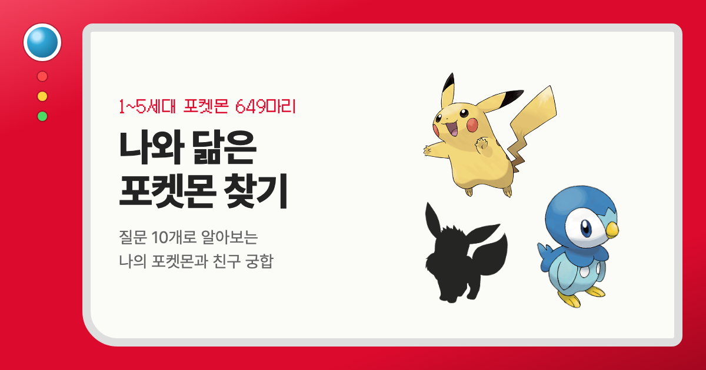

<div align="center">



# 📟 나와 닮은 포켓몬 찾기

**질문 10개로 1~5세대 포켓몬 649마리 중 나와 가장 닮은 포켓몬을 찾아드려요.**<br />
찰떡 파트너와 천적, 친구와의 궁합까지 도감이 분석해 줘요.

### [▶ 스캔 시작하기](https://daniellee09.github.io/pokemon-match/)


</div>

---

## 🔴 도감 기능

| | 기능 | 설명 |
|:-:|---|---|
| 🔍 | **포켓몬 스캔** | 질문 10개에 답하면 몬스터볼이 흔들리고… 나와 닮은 포켓몬이 등장해요 |
| 📊 | **판단 근거** | 5가지 성향 축에서 나와 포켓몬의 위치를 비교하고, 왜 닮았는지 쉬운 말로 알려줘요 |
| 💞 | **찰떡 파트너** | 성격은 통하고 서로의 약점 타입을 막아주는 최고의 동료 |
| ⚔️ | **천적** | 효과가 굉장한 공격으로 나를 노리는 포켓몬 |
| 🤝 | **친구 궁합** | 초대 링크를 보내면 친구의 포켓몬과 궁합 점수·등급이 나와요 |

> 🎲 질문 순서와 선택지 순서는 매번 섞이지만, 같은 답을 고르면 결과는 항상 같아요.

---

## 🧪 오박사의 연구 노트: 어떻게 판단하나요?

모든 포켓몬의 성격은 **공식 게임 데이터**([PokeAPI](https://pokeapi.co))로 계산했어요.
직접 정한 값이 아니라서 결과 화면에서 근거를 그대로 보여줄 수 있어요.

| 성향 축 | 계산에 쓰는 데이터 |
|---|---|
| ⚡ **활발 ↔ 차분** | 스피드 |
| 🌿 **외향 ↔ 내향** | 친밀도 + 포획률(흔하게 보이는지) + 서식지 (전설·환상은 감점) |
| 🔮 **이성 ↔ 직감** | 특수공격 − 공격 (머리로 싸우나, 몸으로 싸우나) |
| 🔥 **모험 ↔ 신중** | (공격 + 특수공격) − (방어 + 특수방어) |
| 👻 **장난 ↔ 진지** | 타입 (고스트·페어리는 장난, 격투·강철은 진지) + 도감 설명 속 표현 |

1. 각 축의 값을 649마리 전체 기준으로 표준화(z-score)해요.
2. 퀴즈 답변도 같은 척도로 바꿔요.
3. 5차원 공간에서 **거리가 가장 가까운 포켓몬**이 결과가 돼요.

**궁합 공식**

- 💞 **찰떡 파트너 · 친구 궁합** = 성격 궁합 60% + 타입 보완 40%
  - 성격: 가치관(이성↔직감, 장난↔진지)은 비슷할수록, 에너지(활발↔차분, 외향↔내향, 모험↔신중)는 서로 반대일수록 높아요.
  - 타입: 서로의 약점 공격을 잘 버텨줄수록 높아요.
- ⚔️ **천적** = 내 포켓몬을 효과가 굉장한 공격으로 치면서 내 공격은 잘 버티는 포켓몬

---

## 🎒 가방 속 파일들

```
📦 pokemon-match
├── index.html          화면 구조 (도감 디자인)
├── style.css           스타일
├── app.js              퀴즈 진행, 결과 계산, 공유·초대
├── compat.js           궁합 계산 (찰떡 파트너·천적·친구 궁합)
├── data.js             질문 10개와 성향 축
├── pokemon-data.js     649마리 성향 프로필 + 타입 상성표 (자동 생성)
├── og-image.png        링크 미리보기 카드 이미지
└── scripts/
    ├── build_data.py   PokeAPI → pokemon-data.js 생성
    ├── og-image.html   미리보기 카드 원본
    └── render_og.sh    미리보기 카드를 PNG로 렌더링
```

빌드 도구나 라이브러리 없이 **HTML·CSS·JavaScript만으로** 동작해요.

---

## 🏃 모험 시작하기

**로컬에서 실행**

```bash
python3 -m http.server 8000
# → http://localhost:8000
```

**포켓몬 데이터 다시 만들기** (PokeAPI에서 새로 받아요)

```bash
python3 scripts/build_data.py
```

**미리보기 카드 다시 만들기** (Google Chrome 필요)

```bash
./scripts/render_og.sh
```

**배포**: `main` 브랜치에 push하면 GitHub Pages에 1~2분 안에 자동 반영돼요.
CSS·JS 링크의 `?v=` 값을 바꿔야 방문자 브라우저가 새 파일을 받아요.

---

## 📝 알려진 한계

- **데이터로 성격을 추정하는 것 자체가 가정이에요.** "스피드가 빠르면 활발하다"처럼 수치를 성격으로 읽는 방식은 재미를 위한 해석이에요.
- **질문별 점수는 직접 정한 값이에요.** 검증된 심리검사 문항은 아니에요.
- **4~5세대는 서식지 정보가 없어요.** PokeAPI에 1~3세대 서식지만 있어서, 4~5세대는 서식지를 빼고 계산해요.
- **모든 포켓몬이 나오지는 않아요.** 가능한 답변 조합 1,048,576가지를 전부 계산하면 649마리 중 645마리가 나와요. 팬텀·루기아·꿀꺽몬·타격귀는 성향이 너무 극단적이거나 비슷한 포켓몬에 가려져서 나오지 않아요.

---

<div align="center">

데이터 출처 [PokeAPI](https://pokeapi.co) · 폰트 [Pretendard](https://github.com/orioncactus/pretendard), [Galmuri](https://github.com/quiple/galmuri)

포켓몬 이미지와 명칭의 저작권은 © Nintendo / Creatures / GAME FREAK에 있어요.<br />
이 프로젝트는 비상업적인 팬 프로젝트예요.

**가라, 몬스터볼! 🔴⚪**

</div>
